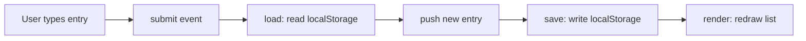

# [Project Name]

<!-- Badges are optional but cheap. shields.io generates them from a URL. -->


> HW3, MGT 3745 O. Replace every bracketed prompt. Delete the HTML comments when done.
> This README is the first thing an employer, a teammate, or an agent reads. It makes
> a case for the repository. Show, then tell.

## What

[One paragraph: the problem, the user, and the feature you built.]

For the full story: [`PROJECT.md`](context/PROJECT.md) frames the problem, [`FEATURES.md`](context/FEATURES.md) specifies what it must do.

## See It Work

<!-- REQUIRED: at least one image or GIF of the feature meeting an EARS statement.
     Put media in the docs/ folder. Keep GIFs under 5 MB.
     Record: macOS Cmd+Shift+5, Windows Win+Alt+R or Snipping Tool video. Convert at ezgif.com.
     Markdown image syntax: -->


<!-- HTML gives you sizing control markdown does not: -->
<!--  -->

## How to Run

1. [Exact steps. "Open `index.html` in a browser" is acceptable if true.]
2. [If it needs a Codespace, say so.]

## How It Works

<!-- GitHub renders Mermaid natively inside a ```mermaid fence. -->



Three functions. `load` reads what persists, `save` writes it, `render` draws the current state. Everything else is wiring.

## Status

| Area | State | Why |
|------|-------|-----|
| Save and display | [Works / Partial / Broken] | |
| Data survives reload | | |
| Multi-user sync | Deferred | [ADR-001](context/ARCHITECTURE.md) chose localStorage; revisit in Module 4 |

<details>
<summary>Verification results (click to expand)</summary>

<!-- Paste or summarize the verification table from FEATURES.md. -->

| # | Acceptance statement | Outcome |
|---|----------------------|---------|
| 1 | | |

</details>

## Links

Read in this order:

1. [`context/PROJECT.md`](context/PROJECT.md): the problem and its framing
2. [`context/USERS.md`](context/USERS.md): who this is for
3. [`context/FEATURES.md`](context/FEATURES.md): what it must do, and verification results
4. [`context/ARCHITECTURE.md`](context/ARCHITECTURE.md): the gate and ADR-001
5. [`context/STANDARDS.md`](context/STANDARDS.md): the rules this code follows
6. [`context/CLAUDE.md`](context/CLAUDE.md): the same rules, for agents

## AI Use

[What Copilot or any other tool drafted, and what you inspected or changed. A paragraph is enough this week.]

<!-- Things this README could also do, if they earn their place:
     - GitHub alerts:  > [!NOTE]  > [!WARNING]  > [!TIP]
     - Task lists:     - [x] done   - [ ] not yet
     - Emoji:          :rocket: :white_check_mark:
     - Footnotes:      text[^1]  ...  [^1]: the note
     - Embedded HTML tables, <kbd>Ctrl</kbd>+<kbd>S</kbd>, <sup>, <sub>
     None are required. A README that reads well with none of them beats one that uses all of them. -->
