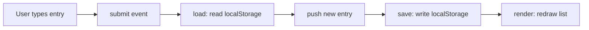

# [Project Name]

<!-- Badges are optional but cheap. shields.io generates them from a URL. -->


> HW3, MGT 3745 O. Replace every [bracketed prompt] with your own writing.
> Lines between `<!--` and `-->` are notes to you. They are invisible on GitHub. Delete them when done.
> This README is the first thing an employer, a teammate, or an agent reads. It makes
> a case for the repository. Show, then tell.

## What

Replace this title and paragraph with your chosen feature and link [PROJECT.md](context/PROJECT.md) and [FEATURES.md](context/FEATURES.md). This runnable "meeting notes" application is a teaching starter, not a completed student submission. Adapt it to your researched feature and make a meaningful change you can explain.

## See It Work

<!-- REQUIRED: at least one image or GIF of the feature meeting an EARS statement.
     Put media in the docs/ folder. Keep GIFs under 5 MB.
     Record: macOS Cmd+Shift+5, Windows Win+Alt+R or Snipping Tool video. Convert at ezgif.com.
     Markdown image syntax: -->
Put a screenshot or GIF under docs/ and link it here with descriptive alt text. Explain which acceptance criterion it demonstrates. A screenshot does not prove reload or storage behavior by itself.


<!-- HTML gives you sizing control markdown does not: -->
<!--  -->

## How to Run

This project runs inside a GitHub Codespace. No local install.

1. On the repository page, click **Code → Codespaces → Create codespace on main**. First boot takes about a minute.
2. In the file explorer, right-click `index.html` and choose **Open with Live Server**.
3. A browser tab opens automatically at the forwarded port (`https://…-5500.app.github.dev`). If it does not, open the **Ports** tab in the terminal panel and click the globe icon next to port 5500.
4. Edit any file; Live Server reloads the page on save.

<!-- The .devcontainer folder installs Live Server automatically. If the right-click option
     is missing, wait for the extension to finish installing (bottom-left status bar), or run
     `python3 -m http.server 5500` in the terminal and open port 5500 from the Ports tab.
     Edit these steps if your feature needs anything more. -->

## How It Works

<!-- GitHub renders Mermaid natively inside a ```mermaid fence. -->



Three functions. `load` reads what persists, `save` writes it, `render` draws the current state. Everything else is wiring.

## Status

| Area | State | Why |
|------|-------|-----|
| Save and display | [Works / Partial / Broken] | |
| Data survives reload | | |
| Multi-user sync | Deferred | [ADR-001](context/ARCHITECTURE.md) chose localStorage; revisit in Module 4 |

<details>
<summary>Verification results (click to expand)</summary>

<!-- Paste or summarize the verification table from FEATURES.md. -->

| # | Acceptance statement | Outcome |
|---|----------------------|---------|
| 1 | | |

</details>

## Links

Read in this order:

1. [`context/PROJECT.md`](context/PROJECT.md): the problem and its framing
2. [`context/USERS.md`](context/USERS.md): who this is for
3. [`context/FEATURES.md`](context/FEATURES.md): what it must do, and verification results
4. [`context/ARCHITECTURE.md`](context/ARCHITECTURE.md): the gate and ADR-001
5. [`context/STANDARDS.md`](context/STANDARDS.md): the rules this code follows
6. [`context/CLAUDE.md`](context/CLAUDE.md): the same rules, for agents

## AI Use

<!-- A Delegation Decision Record without the name. From HW5 this becomes a formal DDR. -->

**What was delegated:** [Which parts a tool drafted: e.g. "Copilot drafted render() and the CSS."]

**Why:** [The reason it made sense to delegate that part rather than write it.]

**How it was checked:** [What you inspected, what you changed, what you caught. "Replaced innerHTML with textContent" is the kind of sentence that belongs here.]

**Actual hours on this assignment:** [A number. Never graded; used to calibrate future assignments.]

<!-- Things this README could also do, if they earn their place:
     - GitHub alerts:  > [!NOTE]  > [!WARNING]  > [!TIP]
     - Task lists:     - [x] done   - [ ] not yet
     - Emoji:          :rocket: :white_check_mark:
     - Footnotes:      text[^1]  ...  [^1]: the note
     - Embedded HTML tables, <kbd>Ctrl</kbd>+<kbd>S</kbd>, <sup>, <sub>
     None are required. A README that reads well with none of them beats one that uses all of them. -->
